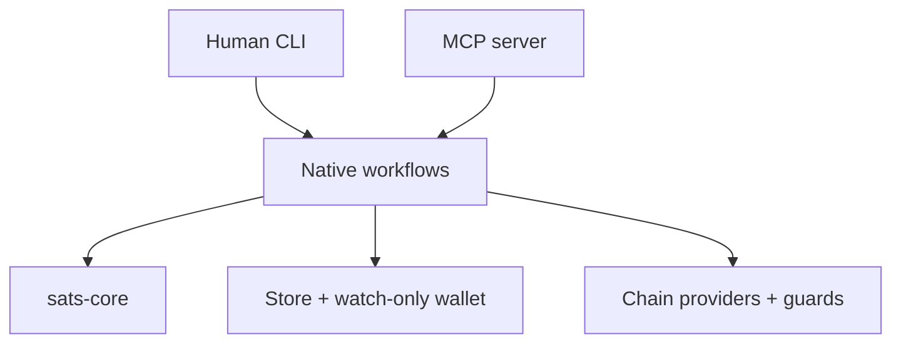
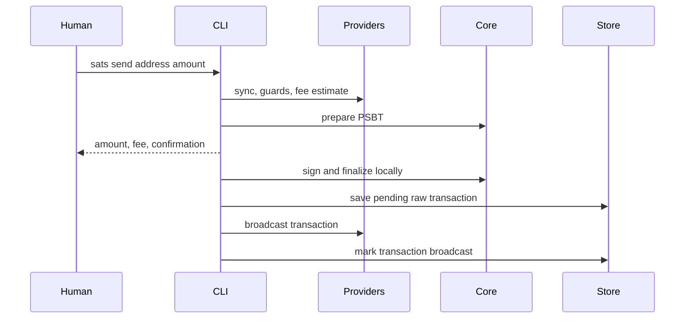
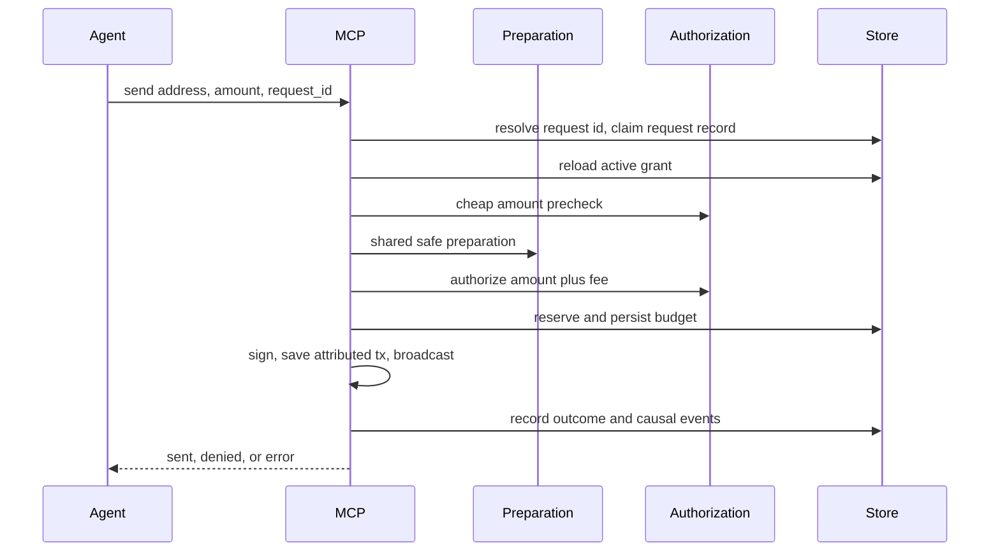

# Architecture

sats is a native Bitcoin wallet with a portable core. The CLI and MCP server
share wallet state and transaction preparation, while agent sends add a
bounded authorization step before signing.

## System shape

`crates/sats-core` owns deterministic wallet and authorization behavior.
`crates/sats` owns environment effects: command parsing, terminal rendering,
files, SQLite, network clients, provider selection, passwords, and MCP stdio.

## Crates

### `sats-core`

The portable engine has no filesystem, network, clock, terminal, or async
runtime dependencies. Callers provide time and operate on a BDK wallet they
own.

| Module | Responsibility |
|---|---|
| `authz` | Grant model, spend request, deterministic allow/deny decision, reservation and refund |
| `engine` | In-memory PSBT preparation and conservative UTXO exclusion |
| `plan` | Prepared spends, legacy PSBT sessions, finalized transaction records, and legacy-plan conversion |
| `seed` | BIP-39 generation and parsing; BIP-86 public and private descriptors |
| `seal` | Versioned Argon2id/XChaCha20-Poly1305 secret envelopes |
| `signer` | Environment-neutral signer trait and local mnemonic signer |
| `error`, `fmt`, `amount` | Typed errors, satoshi formatting, and shorthand amount parsing |

### `sats`

The native crate composes the portable core with operating-system and network
adapters.

| Module | Responsibility |
|---|---|
| `main`, `cli` | Parse global flags and commands, resolve the selected network, dispatch workflows |
| `commands` | Human CLI workflows and their text/JSON presentation |
| `config` | TOML configuration and canonical network names |
| `store` | XDG paths, atomic files, PSBT sessions, finalized transactions, legacy plans, grants, and sensitive-file permissions |
| `walletd` | SQLite-backed watch-only BDK wallet creation, loading, and persistence |
| `provider` | Typed capabilities, driver resolution, chain access, and UTXO guards |
| `keys`, `password` | Unlock the master seed or a grant-wrapped seed |
| `mcp` | MCP stdio server, tool schemas, and agent send orchestration |
| `ui` | Terminal presentation |

`main.rs` is the composition root. Leaf feature logic belongs in the owning
module, not in dispatch.

### `sats-alkanes`

Pure Alkanes protocol composition: alkane ids, LEB128 varints, cellpack
call encoding, the protostone/runestone OP_RETURN envelope, bytecode
code-hashing, and tolerant simulation-result views. Byte encodings are
derived from the published alkanes-rs reference and frozen by unit
vectors. Environment-agnostic like `sats-core`: chain access, funding,
and signing stay with the `sats` crate.

### `sats-web`

The website playground: `sats-core` compiled to WebAssembly behind a small
JSON API for the interactive terminal at the project website. Only the chain
is simulated (an in-memory faucet and instant confirmation); planning, UTXO
exclusion, signing, sealing, and grant authorization run the same core code
as the native surfaces. It holds no compatibility surface — the CLI and MCP
schemas remain the stable contracts — and it must never gain filesystem,
network, or native-store dependencies.

## Persistent state

Without `SATS_DIR`, configuration and data use platform XDG locations.
`SATS_DIR` places both under one directory, which is useful for tests and
isolated runs.

| State | Path relative to the data/config root | Contents |
|---|---|---|
| Configuration | `config.toml` | Default network and typed providers |
| Master seed | `seed.sealed` | Password-sealed mnemonic |
| Wallet | `<network>/wallet.sqlite` | Public descriptors and BDK changes only |
| PSBT sessions | `<network>/psbts/<id>.json` | Read-only legacy state from older releases' staged workflow; new exports are PSBT file artifacts |
| Finalized transactions | `<network>/transactions/<txid>.json` | Private raw transaction hex, pending/broadcast status, and payment metadata |
| Legacy plans | `<network>/plans/<id>.json` | Pre-refactor state; read, permission-hardened, and converted on sign/broadcast |
| Grants | `<network>/grants/<agent>.json` | Limits, accounting, and grant-wrapped seed |
| Agent requests | `<network>/agent-requests/<agent>/<id>.json` | One durable record per agent send: canonical intent digest, idempotency key, and resolved outcome |
| Event log | `<network>/events/log.jsonl` | Append-only causal record of the agent path: one JSON line per state transition |

Wallet state, sessions, transactions, legacy plans, and grants are namespaced
by Bitcoin network. The sealed master seed is shared so each network derives
from the same mnemonic. Sensitive files are written atomically with
restrictive permissions.

## Human send

The shared preparation pipeline validates the address before network I/O, syncs
the wallet, builds the union of dust and configured-guard exclusions,
estimates the fee when none was supplied, and asks `sats-core` to build the
PSBT. Preparation fails rather than using stale state after a sync failure.

The prepared PSBT stays in memory during a normal send. After finalization,
sats writes private raw transaction hex before any broadcast attempt. A
broadcast failure therefore leaves a pending transaction that can be retried
without retaining the signed PSBT.

## Agent send

The amount-only precheck rejects an obviously impossible request before
network access. Final authorization uses the prepared fee. Budget is
persisted before signing; it is refunded only if signing fails before a
signature exists. Broadcast failure leaves both the finalized transaction
record and budget reservation intact.

Every agent send is a durable request record: a keyed retry replays a
signed outcome instead of paying twice, and each state transition —
received, denied, reserved, signed, broadcast, refunded — appends to the
per-network event log. Finalized transactions carry an `origin` naming the
surface, agent, request, and canonical intent digest.

## Provider model

A provider is bound to one network and advertises audited capabilities:

- `chain.sync`;
- `chain.fees`;
- `chain.broadcast`;
- `guard.ord`;
- `guard.alkanes`;
- `guard.native` for deterministic tests;
- `alkanes.view` for the explicit `sats alkanes` contract tools.

Provider resolution is configuration work and performs no network I/O.
Operations validate the selected network when they execute. See
[Providers and guards](providers.md) for precedence and configuration.

## Change map

| Change | Primary owner | Required checks |
|---|---|---|
| Transaction selection, preparation, or finalized-record metadata | `sats-core::engine`, `sats-core::plan` | Core unit tests plus CLI/MCP integration paths |
| Grant rule or accounting | `sats-core::authz` | Decision edge cases, persistence ordering, MCP denial tests |
| Human command or flag | `cli`, `commands`, `main` dispatch | CLI integration test and `docs/cli.md` |
| MCP tool or result schema | `mcp::server` | MCP integration test and `docs/mcp.md` |
| Provider driver or capability | `provider`, `config` | Mocked driver, network mismatch, ambiguity and failure tests |
| Persisted state | `store`, `walletd`, relevant core model | Backward-reading and atomic-write tests |
| Key or signing behavior | `seed`, `seal`, `signer`, `keys` | Security-focused unit and end-to-end signing tests |

Read [AGENTS.md](../AGENTS.md) before implementing any of these changes.
