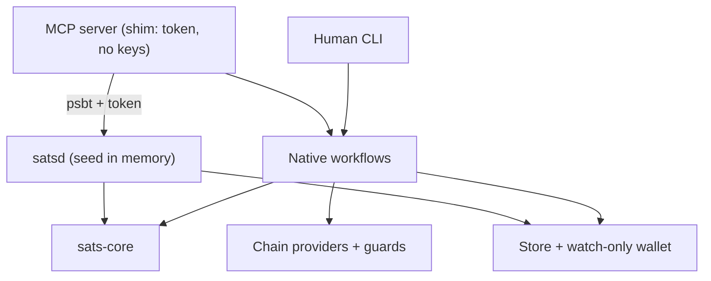
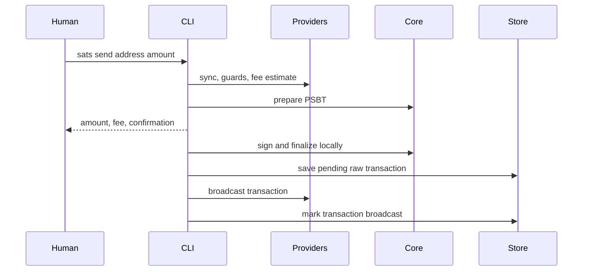
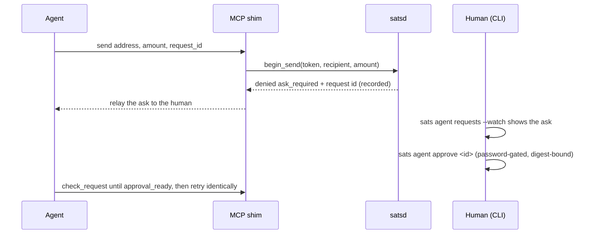
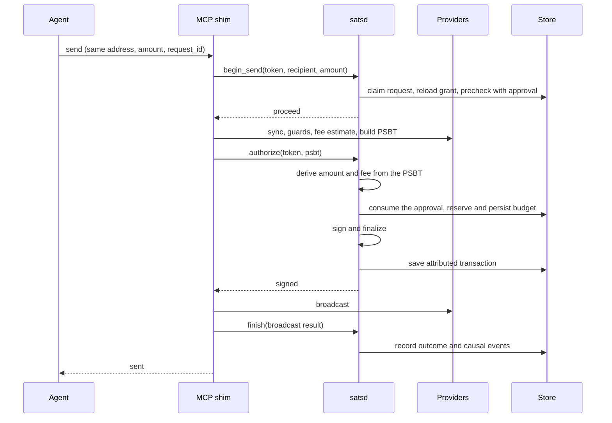

# Architecture

sats is a native Bitcoin wallet with a portable core. The CLI and MCP server
share wallet state and transaction preparation, while agent sends add
deterministic authorization and a one-time human approval before signing —
enforced in a separate process that holds the only copy of the key. No
agent-originated spend reaches the signer unapproved; the direction this
implements is in [Direction](direction.md).

## System shape

A human send unlocks the seed for the duration of one command and never
involves the daemon. An agent send cannot sign at all: the served process
prepares a PSBT and asks satsd, which derives what the transaction does,
decides, signs, and persists — and satsd signs only when a human has
approved exactly that payment, once, through the CLI's review queue.

`crates/sats-core` owns deterministic wallet and authorization behavior.
`crates/sats` owns environment effects: command parsing, terminal rendering,
files, SQLite, network clients, provider selection, passwords, and MCP stdio.

## Crates

### `sats-core`

The portable engine has no filesystem, network, clock, terminal, or async
runtime dependencies. Callers provide time and operate on a BDK wallet they
own.

| Module | Responsibility |
|---|---|
| `authz` | Grant model, spend request, the deterministic verdict ladder (every send terminates in ask or deny), one-time approvals, reservation and refund |
| `token` | Agent capability tokens: mint, hash, constant-time verify |
| `verify` | Recomputing a PSBT's payments and fee from the wallet's own descriptors |
| `engine` | In-memory PSBT preparation and conservative UTXO exclusion |
| `plan` | Prepared spends and finalized transaction records |
| `seed` | BIP-39 generation and parsing; BIP-86 public and private descriptors |
| `seal` | Versioned Argon2id/XChaCha20-Poly1305 secret envelopes |
| `signer` | Environment-neutral signer trait and local mnemonic signer |
| `error`, `fmt`, `amount` | Typed errors, satoshi formatting, and shorthand amount parsing |

### `sats`

The native crate composes the portable core with operating-system and network
adapters.

| Module | Responsibility |
|---|---|
| `main`, `cli` | Parse global flags and commands, resolve the selected network, dispatch workflows |
| `commands` | Human CLI workflows and their text/JSON presentation |
| `config` | TOML configuration and canonical network names |
| `store` | XDG paths, atomic files, finalized transactions, grants, requests, the event log, and sensitive-file permissions |
| `walletd` | SQLite-backed watch-only BDK wallet creation, loading, and persistence |
| `provider` | Typed capabilities, driver resolution, chain access, and UTXO guards |
| `keys`, `password` | Unlock the master seed; prove the password without keeping anything |
| `daemon` | satsd: unix-socket protocol, lock state, and the granted agent send path |
| `mcp` | MCP stdio server and tool schemas — a shim over the daemon |
| `ui` | Terminal presentation |

`main.rs` is the composition root. Leaf feature logic belongs in the owning
module, not in dispatch.

### `sats-alkanes`

Pure Alkanes protocol composition: alkane ids, LEB128 varints, cellpack
call encoding, the protostone/runestone OP_RETURN envelope, bytecode
code-hashing, and tolerant simulation-result views. Byte encodings are
derived from the published alkanes-rs reference and frozen by unit
vectors. Environment-agnostic like `sats-core`: chain access, funding,
and signing stay with the `sats` crate.

### `sats-web`

The website playground: `sats-core` compiled to WebAssembly behind a small
JSON API for the interactive terminal at the project website. Only the chain
is simulated (an in-memory faucet and instant confirmation); planning, UTXO
exclusion, signing, sealing, and grant authorization run the same core code
as the native surfaces. There is no daemon in a web page, so the playground
demonstrates the grant model without the process boundary that enforces it
natively. It holds no compatibility surface — the CLI and MCP schemas remain
the stable contracts — and it must never gain filesystem, network, or
native-store dependencies.

## Persistent state

Without `SATS_DIR`, configuration and data use platform XDG locations.
`SATS_DIR` places both under one directory, which is useful for tests and
isolated runs.

| State | Path relative to the data/config root | Contents |
|---|---|---|
| Configuration | `config.toml` | Default network and typed providers |
| Master seed | `seed.sealed` | Password-sealed mnemonic |
| Wallet | `<network>/wallet.sqlite` | Public descriptors and BDK changes only |
| Finalized transactions | `<network>/transactions/<txid>.json` | Private raw transaction hex, pending/broadcast status, and payment metadata |
| Legacy plans | `<network>/plans/<id>.json` | Pre-refactor state; read, permission-hardened, and converted on sign/broadcast |
| Grants | `<network>/grants/<agent>.json` | Authority mode, limits, accounting, and the bearer token's hash — no key material |
| Daemon socket | `$XDG_RUNTIME_DIR/sats/<network>.sock`, or `<network>/d.sock` under `SATS_DIR` | satsd's owner-only control socket |
| Daemon log | `<network>/satsd.log` | Diagnostics from a backgrounded `sats daemon start` |
| Daemon lifetime lock | Socket path with `.lock` extension | Private OS file lock held until process exit; not deleted on shutdown |
| Agent requests | `<network>/agent-requests/<agent>/<id>.json` | One durable record per agent send: canonical intent digest, idempotency key, and resolved outcome |
| Event log | `<network>/events/log.jsonl` | Append-only causal record of the agent path: one JSON line per state transition |

Wallet state, transactions, requests, and grants are namespaced
by Bitcoin network. The sealed master seed is shared so each network derives
from the same mnemonic. Sensitive files are written atomically with
restrictive permissions.

On macOS, an opt-in user LaunchAgent can supervise `daemon run` independently
of the MCP client. Its identity includes the network and canonical socket
path; startup remains locked. Service management lives in native commands,
not core or the MCP process. MCP startup validates grant/token/wallet/config,
but daemon unavailability is operational and discoverable through `get_status`.
Preparation stage observers send MCP progress without changing authorization.
The MCP process still owns preparation and broadcast; supervision of the
signer does not make interrupted sends durable jobs.

Native HTTP uses a pinned local `minreq` patch for bounded TCP address
fallback. A failed address cannot consume the whole request deadline while
other DNS candidates remain. No HTTP bytes are sent during this fallback;
provider identity, TLS hostname verification and broadcast retry semantics
remain unchanged. The portable core has no transport dependency.

On macOS, `daemon::unlock` owns authenticated human unlock requests. MCP
forwards the named grant/token over a dedicated, cancellable connection.
satsd launches a fixed local dialog helper, receives its password through a
private pipe, revalidates the grant and human consent, then unlocks using the
existing throttled session path. Only a typed outcome returns to MCP. No
password, helper pipe, or key material is available to the MCP process, and
no new wallet/grant format is introduced. Other daemon connections remain
available while a dialog is open.

## Human send

The shared preparation pipeline validates the address before network I/O, syncs
the wallet, builds the union of dust and configured-guard exclusions,
estimates the fee when none was supplied, and asks `sats-core` to build the
PSBT. Preparation fails rather than using stale state after a sync failure.

The prepared PSBT stays in memory during a normal send. After finalization,
sats writes private raw transaction hex before any broadcast attempt. A
broadcast failure therefore leaves a pending transaction that can be retried
without retaining the signed PSBT.

## Agent send: the approval loop

Every agent send is two passes around one loop — the ask, then the
approved retry. The grant alone never authorizes a spend; the ladder
terminates every in-envelope proposal in the approvable `ask_required`,
so a novel send stops at the precheck, before any network access, as a
durable request for the human's queue:

The identical retry finds the armed approval at the precheck and proceeds
to preparation and signing:

A send spans one connection: the claim taken by `begin_send` is released
when the connection closes, so a caller that dies mid-send strands nothing.
The request lifecycle is durable throughout: pending means denied and not
dismissed; `Sent` and signed-`Failed` outcomes replay verbatim on a keyed
retry; denials are side-effect free, so a retry re-evaluates.

Final authorization uses the fee the daemon derived, never one the caller
reported, and the one-time approval — digest-bound to network, agent,
recipient, and amount, under its own fee ceiling — is the only authority
that can allow the reservation. The approval is consumed before the
budget draw, budget is persisted before signing, and the signer is
constructed only after the reservation succeeds, so no denied or
unapproved request can ever reach it. Budget is refunded only if signing
fails before a signature exists. The finalized transaction is persisted
by the process that signed it, before the result is returned — a signed
transaction never crosses the socket. Broadcast failure leaves both the
transaction record and the budget reservation intact.

Every agent send is a durable request record: a keyed retry replays a
signed outcome instead of paying twice, and each state transition —
received, denied, reserved, signed, broadcast, refunded — appends to the
per-network event log. Finalized transactions carry an `origin` naming the
surface, agent, request, and canonical intent digest.

## Provider model

A provider is bound to one network and advertises audited capabilities:

- `chain.sync`;
- `chain.fees`;
- `chain.broadcast`;
- `guard.ord`;
- `guard.alkanes`;
- `guard.native` for deterministic tests;
- `alkanes.view` for the explicit `sats alkanes` contract tools.

Provider resolution is configuration work and performs no network I/O.
Operations validate the selected network when they execute. See
[Providers and guards](providers.md) for precedence and configuration.

## Change map

| Change | Primary owner | Required checks |
|---|---|---|
| Transaction selection, preparation, or finalized-record metadata | `sats-core::engine`, `sats-core::plan` | Core unit tests plus CLI/MCP integration paths |
| Grant rule or accounting | `sats-core::authz` | Decision edge cases, persistence ordering, MCP denial tests |
| What a PSBT is taken to do | `sats-core::verify` | Adversarial derivation tests: forged hints, extra outputs, foreign inputs |
| Daemon protocol or lock state | `daemon` | Wire round-trips, lock/unlock, `crates/sats/tests/daemon.rs` |
| Human command or flag | `cli`, `commands`, `main` dispatch | CLI integration test and `docs/cli.md` |
| MCP tool or result schema | `mcp::server` | MCP integration test and `docs/mcp.md` |
| Provider driver or capability | `provider`, `config` | Mocked driver, network mismatch, ambiguity and failure tests |
| Persisted state | `store`, `walletd`, relevant core model | Backward-reading and atomic-write tests |
| Key or signing behavior | `seed`, `seal`, `signer`, `keys` | Security-focused unit and end-to-end signing tests |

Read [AGENTS.md](../AGENTS.md) before implementing any of these changes.
