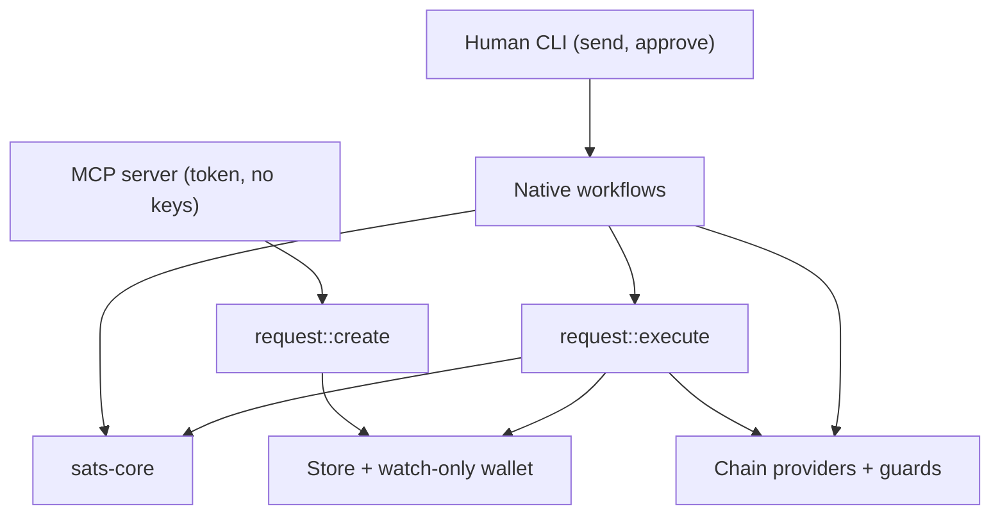
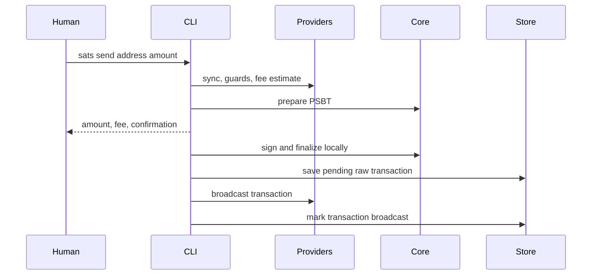
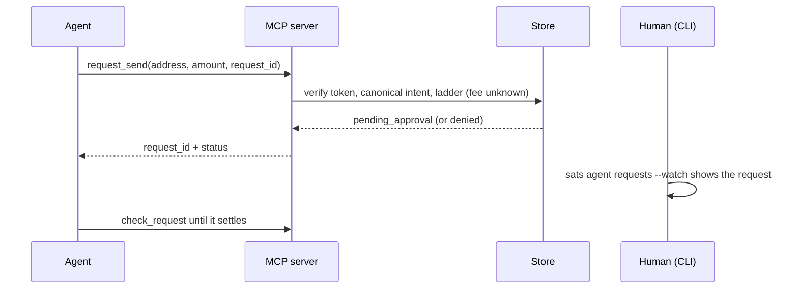

# Architecture

sats is a native Bitcoin wallet with a portable core. Agents create
requests, humans authorize requests, sats executes requests: the MCP
server files a request under a grant, the human reviews it and executes
it with `sats agent approve`, and the agent observes the result. No
agent-originated request reaches the signer unapproved; the direction this
implements is in [Direction](direction.md).

## System shape



A human send unlocks the seed for the duration of one command. An agent
cannot sign at all: the served process writes a request record and
nothing else. `sats agent approve` prepares the transaction, derives what
it pays from the wallet's descriptors, re-checks the grant with the real
fee, takes the human's password, reserves the budget, signs, persists, and
broadcasts — in the human's process, for exactly one request.

`crates/sats-core` owns deterministic wallet and authorization behavior.
`crates/sats` owns environment effects: command parsing, terminal rendering,
files, SQLite, network clients, provider selection, passwords, and MCP stdio.

## Crates

### `sats-core`

The portable engine has no filesystem, network, clock, terminal, or async
runtime dependencies. Callers provide time and operate on a BDK wallet they
own.

| Module | Responsibility |
|---|---|
| `authz` | Grant model, spend request, the deterministic verdict ladder (every proposal is ask or deny), reservation and refund |
| `request` | The request record and its state machine, with the signature boundary structural |
| `intent` | The canonical send intent and its digest |
| `event` | The causal event kinds appended per request transition |
| `token` | Agent capability tokens: mint, hash, constant-time verify |
| `verify` | Recomputing a PSBT's payments and fee from the wallet's own descriptors |
| `engine` | In-memory PSBT preparation and conservative UTXO exclusion |
| `plan` | Prepared spends and finalized transaction records |
| `seed` | BIP-39 generation and parsing; BIP-86 public and private descriptors |
| `seal` | Versioned Argon2id/XChaCha20-Poly1305 secret envelopes |
| `signer` | Environment-neutral signer trait and local mnemonic signer |
| `error`, `fmt`, `amount` | Typed errors, satoshi formatting, and shorthand amount parsing |

### `sats`

The native crate composes the portable core with operating-system and network
adapters.

| Module | Responsibility |
|---|---|
| `main`, `cli` | Parse global flags and commands, resolve the selected network, dispatch workflows |
| `commands` | Human CLI workflows and their text/JSON presentation |
| `config` | TOML configuration and canonical network names |
| `store` | XDG paths, atomic files, finalized transactions, grants, requests, the event log, and sensitive-file permissions |
| `walletd` | SQLite-backed watch-only BDK wallet creation, loading, and persistence |
| `provider` | Typed capabilities, driver resolution, chain access, and UTXO guards |
| `keys`, `password` | Unlock the master seed; prove the password without keeping anything |
| `request` | The native request workflow: create, dismiss, reconcile, and the human-authorized executor (`stage`, `commit`) |
| `spend` | The shared signing and broadcast tail: persist before broadcast |
| `mcp` | MCP stdio server and tool schemas — reads the wallet and files requests |
| `ui` | Terminal presentation |

`main.rs` is the composition root. Leaf feature logic belongs in the owning
module, not in dispatch.

### `sats-alkanes`

Pure Alkanes protocol composition: alkane ids, LEB128 varints, cellpack
call encoding, the protostone/runestone OP_RETURN envelope, bytecode
code-hashing, and tolerant simulation-result views. Byte encodings are
derived from the published alkanes-rs reference and frozen by unit
vectors. Environment-agnostic like `sats-core`: chain access, funding,
and signing stay with the `sats` crate.

### `sats-web`

The website playground: `sats-core` compiled to WebAssembly behind a small
JSON API for the interactive terminal at the project website. Only the chain
is simulated (an in-memory faucet and instant confirmation); planning, UTXO
exclusion, signing, sealing, and grant authorization run the same core code
as the native surfaces. There is no separate process in a web page, so the playground
demonstrates the grant model without the process boundary that enforces it
natively. It holds no compatibility surface — the CLI and MCP schemas remain
the stable contracts — and it must never gain filesystem, network, or
native-store dependencies.

## Persistent state

Without `SATS_DIR`, configuration and data use platform XDG locations.
`SATS_DIR` places both under one directory, which is useful for tests and
isolated runs.

| State | Path relative to the data/config root | Contents |
|---|---|---|
| Configuration | `config.toml` | Default network and typed providers |
| Master seed | `seed.sealed` | Password-sealed mnemonic |
| Wallet | `<network>/wallet.sqlite` | Public descriptors and BDK changes only |
| Finalized transactions | `<network>/transactions/<txid>.json` | Private raw transaction hex, pending/broadcast status, payment metadata, and the originating request |
| Grants | `<network>/grants/<agent>.json` | Authority mode, limits, accounting, and the bearer token's hash — no key material |
| Agent requests | `<network>/agent-requests/<agent>/<id>.json` | One durable record per request: canonical intent digest, idempotency key, and its state |
| Request claims | `<network>/agent-requests/<agent>/<id>.lock` | Private OS file lock held while one process executes or reconciles the request |
| Event log | `<network>/events/log.jsonl` | Append-only causal record of the agent path: one JSON line per state transition |

Wallet state, transactions, requests, and grants are namespaced
by Bitcoin network. The sealed master seed is shared so each network derives
from the same mnemonic. Sensitive files are written atomically with
restrictive permissions.

Native HTTP uses a pinned local `minreq` patch for bounded TCP address
fallback. A failed address cannot consume the whole request deadline while
other DNS candidates remain. No HTTP bytes are sent during this fallback;
provider identity, TLS hostname verification and broadcast retry semantics
remain unchanged. The portable core has no transport dependency.

## Human send



The shared preparation pipeline validates the address before network I/O, syncs
the wallet, builds the union of dust and configured-guard exclusions,
estimates the fee when none was supplied, and asks `sats-core` to build the
PSBT. Preparation fails rather than using stale state after a sync failure.

The prepared PSBT stays in memory during a normal send. After finalization,
sats writes private raw transaction hex before any broadcast attempt. A
broadcast failure therefore leaves a pending transaction that can be retried
without retaining the signed PSBT.

## Agent request: file, authorize, execute

Filing happens in the served process and touches nothing but the store:



Execution happens in the human's process, once, with the password:

```mermaid
sequenceDiagram
    participant H as Human
    participant C as sats agent approve
    participant P as Providers
    participant E as Core
    participant S as Store
    H->>C: sats agent approve <id>
    C->>S: claim the request, re-check the grant (fee unknown)
    C->>P: sync, guards, fee estimate
    C->>E: prepare PSBT; derive what it pays; ladder with the real fee
    C-->>H: recipient, amount, fee, total; password
    C->>S: under the grant lock: check the grant instance, reserve budget, then record signing
    C->>E: construct the signer, sign, finalize
    C->>S: save the attributed transaction (before broadcast)
    C->>P: broadcast
    C->>S: record sent, or broadcast_pending
```

The grant is re-read under the lock before the reservation, so revocation
or a tightened boundary between the review and the password still
refuses, and a request executes only under the grant instance that
created it. The reservation and the `signing` record are persisted before
the signer is constructed, so no denied or unauthorized request can reach
it. Budget is refunded only before the signer is invoked, or when the
signer itself reports that no signature was produced. Any other failure
after the signer ran leaves `unresolved`: never refunded, never signed
again. Once the transaction record exists the reservation is final, the
request is never signed again, and a failed broadcast leaves
`broadcast_pending` for `sats tx broadcast` to settle.

A `signing` record left by a dead process is reconciled by the next
listing or approve from the durable truth: a transaction attributed to
the request (`origin` agent, request id, and intent digest all match)
means `broadcast_pending` or `sent`; none means `unresolved`, with
nothing refunded.

Every transition — received, denied, approved, dismissed, reserved,
signed, broadcast, refunded, failed — appends to the per-network event
log. Finalized transactions carry an `origin` naming the surface, agent,
request, and canonical intent digest.

## Provider model

A provider is bound to one network and advertises audited capabilities:

- `chain.sync`;
- `chain.fees`;
- `chain.broadcast`;
- `guard.ord`;
- `guard.alkanes`;
- `guard.native` for deterministic tests;
- `alkanes.view` for the explicit `sats alkanes` contract tools.

Provider resolution is configuration work and performs no network I/O.
Operations validate the selected network when they execute. See
[Providers and guards](providers.md) for precedence and configuration.

## Change map

| Change | Primary owner | Required checks |
|---|---|---|
| Transaction selection, preparation, or finalized-record metadata | `sats-core::engine`, `sats-core::plan` | Core unit tests plus CLI/MCP integration paths |
| Grant rule or accounting | `sats-core::authz` | Decision edge cases, persistence ordering, MCP denial tests |
| What a PSBT is taken to do | `sats-core::verify` | Adversarial derivation tests: forged hints, extra outputs, foreign inputs |
| Request creation, execution, or reconciliation | `request` | Executor unit tests with the signer probe, `crates/sats/tests/mcp.rs` |
| Human command or flag | `cli`, `commands`, `main` dispatch | CLI integration test and `docs/cli.md` |
| MCP tool or result schema | `mcp::server` | MCP integration test and `docs/mcp.md` |
| Provider driver or capability | `provider`, `config` | Mocked driver, network mismatch, ambiguity and failure tests |
| Persisted state | `store`, `walletd`, relevant core model | Backward-reading and atomic-write tests |
| Key or signing behavior | `seed`, `seal`, `signer`, `keys` | Security-focused unit and end-to-end signing tests |

Read [AGENTS.md](../AGENTS.md) before implementing any of these changes.
