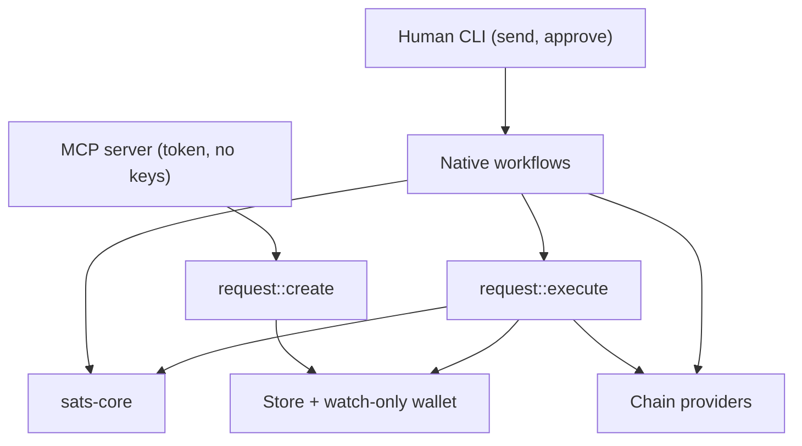
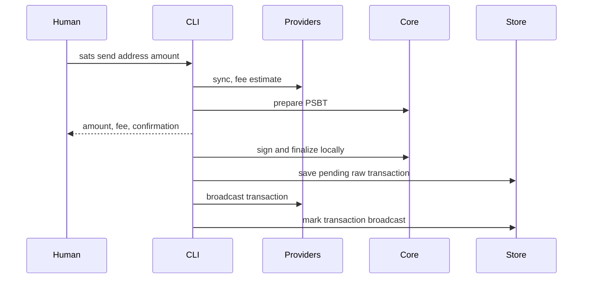
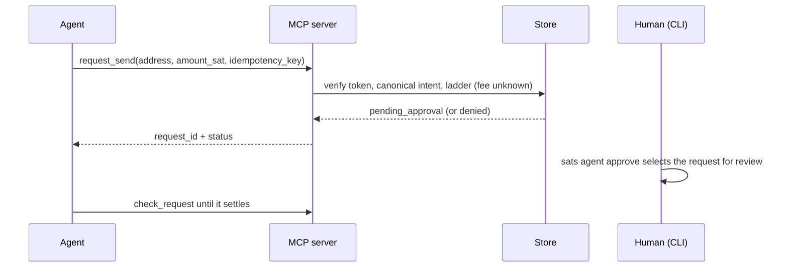

# Architecture

How sats is built: a portable core, a native crate for the CLI and MCP
server, and the one spend path that humans and agents share.

## System shape



A human send unseals the seed for one command. An agent never signs: the MCP
server files a request, and `sats agent approve` executes it in the human's
process, for exactly that request. Both paths share preparation, the dust
exclusion, fee estimation, and the sign-then-persist-then-broadcast tail.

`sats-core` owns deterministic wallet and authorization behavior. `sats` owns
everything with side effects: argument parsing, terminal output, files,
SQLite, network clients, provider selection, passwords, and MCP stdio.

## Crates

### `sats-core`

The portable engine has no filesystem, network, clock, terminal, or async
runtime. Callers pass in time and own the BDK wallet.

| Module | Owns |
|---|---|
| `authz` | Grants, the verdict ladder (every proposal is ask or deny), reservations, refunds |
| `request` | The request record and its state machine |
| `intent` | The canonical send intent and its digest |
| `event` | Event kinds appended per request transition |
| `token` | Agent tokens: mint, hash, constant-time verify |
| `verify` | Recomputing a PSBT's payments and fee from the wallet's descriptors |
| `engine` | PSBT preparation and conservative UTXO exclusion |
| `plan` | Prepared spends and finalized transaction records |
| `seed` | BIP-39 mnemonics; BIP-86 public and private descriptors |
| `seal` | Versioned Argon2id/XChaCha20-Poly1305 envelopes |
| `signer` | The `Signer` trait and the local mnemonic signer |
| `error`, `fmt`, `amount` | Typed errors, sat formatting, amount shorthand |

### `sats`

| Module | Owns |
|---|---|
| `main`, `cli` | Flag parsing, network selection, dispatch. `main.rs` is a composition root only. |
| `commands` | Human CLI workflows and their text and JSON output |
| `config` | TOML configuration and network names |
| `store` | Paths, atomic files, permissions, transactions, grants, requests, the event log |
| `walletd` | The SQLite-backed watch-only BDK wallet |
| `provider` | Per-network chain source, driver resolution, chain access, Alkanes views |
| `keys`, `password` | Unsealing the seed; verifying the password without keeping anything |
| `request` | Request create, dismiss, reconcile, and the executor (`stage`, `commit`) |
| `spend` | The shared tail: sign, persist, then broadcast |
| `mcp` | The MCP stdio server and tool schemas |
| `ui` | Terminal presentation |

### `sats-alkanes`

Pure Alkanes encoding: alkane ids, LEB128 varints, cellpacks, the
protostone/runestone envelope, bytecode hashing, and tolerant simulation
views. Encodings follow the published alkanes-rs reference, frozen by unit
vectors. Like `sats-core`, it does no I/O. Default builds expose inspection
and simulation only; execution sits behind a non-default development
feature.

### `sats-web`

`sats-core` compiled to WebAssembly for the website playground. Only the
chain is simulated. Planning, UTXO exclusion, signing, sealing, and grant
checks run the same core code as the native binary. A web page has no
process boundary, so the playground demonstrates the grant model without
the separation that enforces it natively. It is not a compatibility surface
and must never gain filesystem, network, or store dependencies.

## Persistent state

`config.toml` lives in the config directory and everything else in the data
directory (see [CLI](cli.md#configuration)). `SATS_DIR` puts both in one
directory.

| State | Path | Contents |
|---|---|---|
| Configuration | `config.toml` (owner-only) | Default network, fee targets, providers and their credentials |
| Seed | `seed.sealed` | Password-sealed mnemonic, shared by every network |
| Wallet | `<network>/wallet.sqlite` | Public descriptors and BDK chain state |
| Transactions | `<network>/transactions/<txid>.json` | Raw signed hex, broadcast status, payment metadata, `origin` |
| Grants | `<network>/grants/<agent>.json` | Mode, limits, accounting, token hash. No key material. |
| Requests | `<network>/agent-requests/<agent>/<id>.json` | Intent digest, idempotency key, state, `grant_id` |
| Request locks | `<network>/agent-requests/<agent>/<id>.lock` | OS file lock held while a process executes or reconciles |
| Event log | `<network>/events/log.jsonl` | Append-only, one JSON line per transition |

Sensitive files are written atomically and owner-only. See
[Security](security.md#keys-and-wallet-state).

## Human send



Preparation validates the address before any network I/O and refuses to plan
on stale state. The PSBT stays in memory. Raw signed hex is saved before
broadcast, so a failed broadcast leaves an exact retry.

## Agent request

Filing happens in the MCP server and touches only the store:



Execution happens in the human's process, once, with the password:

```mermaid
sequenceDiagram
    participant H as Human
    participant C as sats agent approve
    participant P as Providers
    participant E as Core
    participant S as Store
    H->>C: sats agent approve (or an explicit id)
    C->>S: claim the request, re-check the grant (fee unknown)
    C->>P: sync, fee estimate
    C->>E: prepare PSBT; derive what it pays; ladder with the real fee
    C-->>H: wallet, network, recipient, amount, fee, total; confirmation and password
    C->>S: under the grant lock: check the grant instance, reserve budget, then record signing
    C->>E: construct the signer, sign, finalize
    C->>S: save the attributed transaction (before broadcast)
    C->>P: broadcast
    C->>S: record sent, or broadcast_pending
```

The reservation and the `signing` record are durable before the signer is
constructed, which is why `request::execute::commit` takes the signer as a
factory. What happens on failure at each step, and how a crash is
reconciled, is specified in [Security](security.md#approving-a-request).

## Providers

Each network has exactly one chain source (mempool.space, Subfrost, or an
Esplora server) for sync, fees, and broadcast. Alkanes views come from
Subfrost when it is set up. Drivers are audited enums.
Resolution is pure configuration work with no network I/O. Operations check
the network when they run. See [Providers](providers.md).

## Change map

| Change | Owner | Prove it with |
|---|---|---|
| Coin selection, preparation, transaction records | `sats-core::engine`, `plan` | Core unit tests plus CLI and MCP paths |
| Grant rule or accounting | `sats-core::authz` | Decision edge cases, persistence order, MCP denial tests |
| What a PSBT is taken to pay | `sats-core::verify` | Adversarial tests: forged hints, extra outputs, foreign inputs |
| Request creation, execution, reconciliation | `request` | Executor tests with the signer probe; `tests/mcp.rs` |
| CLI command or flag | `cli`, `commands`, `main` | CLI integration test; `docs/cli.md` |
| MCP tool or schema | `mcp::server` | MCP integration test; `docs/mcp.md` |
| Provider driver or choice | `provider`, `config` | Mocked driver; network mismatch, unservable choice, failure tests |
| Persisted state | `store`, `walletd`, core model | Read and atomic-write tests |
| Keys or signing | `seed`, `seal`, `signer`, `keys` | Security unit tests and end-to-end signing |

Read [AGENTS.md](../AGENTS.md) before making any of these changes.
